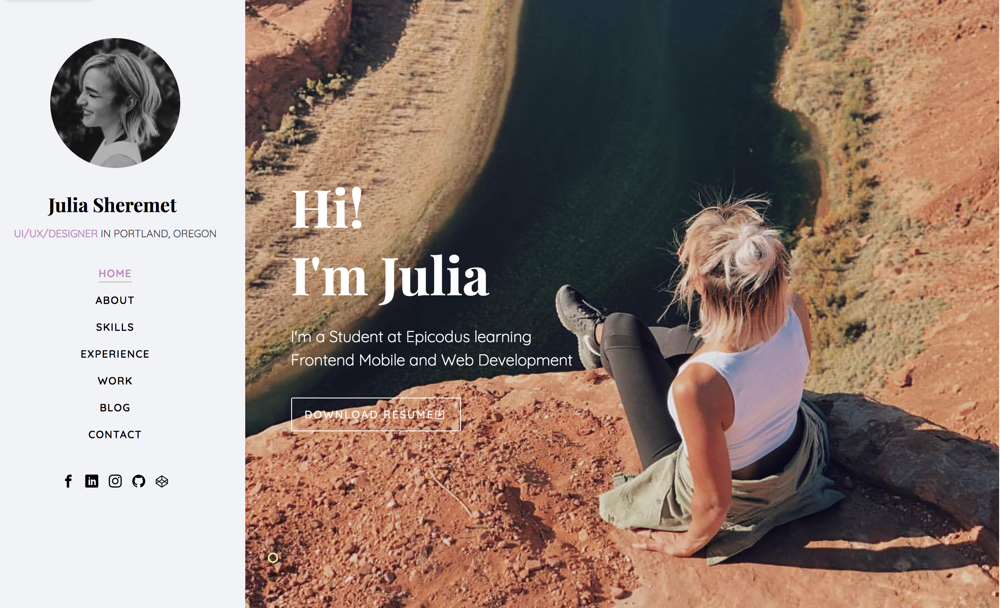
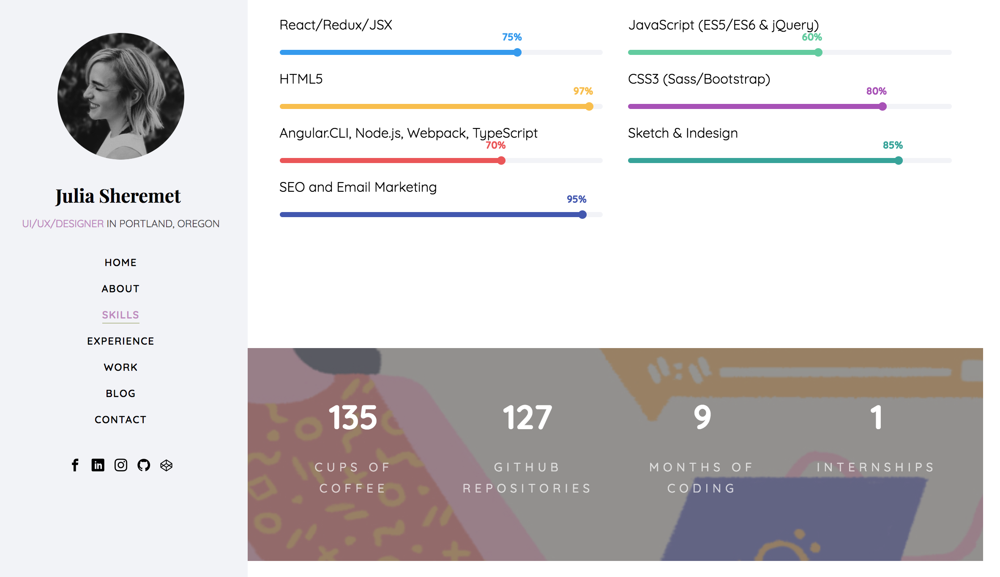
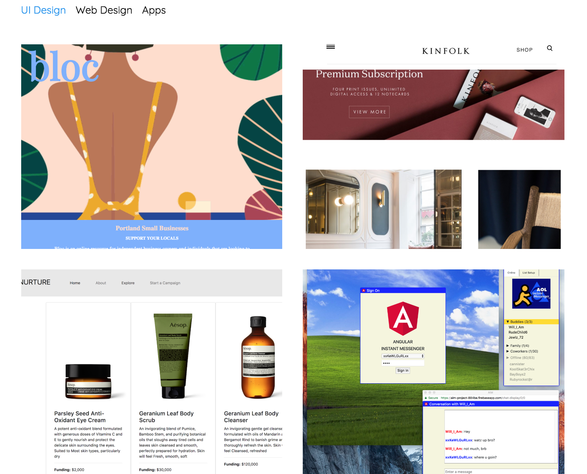

# _
Julia Sheremet Online Portfolio
_

#### _**
By: Julia Sheremet
**_

  

#### View Live portfolio application: https://juliajessica.github.io/juliajessica/

## Application
| Profile Introduction | Skills | Projects |
| :--------- | :--------- | :--------- |
|  |  | |

## Description

_This webpage application is designed to share my virtual portfolio of experience, work, and skills learned as a UI/UX Frontend Student._

## Setup/Installation Requirements :computer:

* Clone repository on your local computer.
* Open Index.html in a browser Window

## Known Bugs

_Feel free to email me at [juliajessicasher@gmail.com](mailto:juliajessicasher@gmail.com) if you run into any issues or have questions, ideas or concerns. Please enjoy and feel free to share your opinion, constructive criticism, or comments of my work. :+1:_

## Technologies Used

| Frontend Dependencies |
| :------------ |
| Webpack |
| CSS(Sass) |
| Bootstrap |
| JavaScript (JQuery) |

### License

Copyright (c) 2018 ****_Julia Sheremet_****

Permission is hereby granted, free of charge, to any person obtaining a copy of this software and associated documentation files (the "Software"), to deal in the Software without restriction, including without limitation the rights to use, copy, modify, merge, publish, distribute, sublicense, and/or sell copies of the Software, and to permit persons to whom the Software is furnished to do so, subject to the following conditions:

The above copyright notice and this permission notice shall be included in all copies or substantial portions of the Software.

<small>&copy; <!-- Link back to Colorlib can't be removed. Template is licensed under CC BY 3.0. -->
Copyright 2018 All rights reserved | This template is made with <i class="icon-heart" aria-hidden="true"></i> by <a href="https://colorlib.com" target="_blank">Colorlib</a>
<!-- Link back to Colorlib can't be removed. Template is licensed under CC BY 3.0. -->  Demo Images: <a href="https://unsplash.com/" target="_blank">Unsplash.com</a></small>

